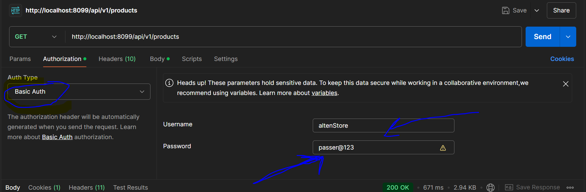

# ecom-alten-store
# 1. Intoduction du projet.
   Ce projet nous permet de gérer le stockage des produits. On peut effectuer les opérations suivantes:

Lister les produits
AJouter un produit
Modifier un produit
Modifier un ou des entites produit(s), modification patch 
Suprimer un produit
# 2. Stack utilisée.
   Voici une description générale des composants intégrés dans le projet:

* Spring Boot 3.3.5: La base même du projet, Spring Boot facilite la création d'applications Java autonomes, en fournissant une configuration par défaut et en minimisant la nécessité de configurations manuelles.
* Spring Web: Spring Web est une partie du framework Spring qui facilite le développement d'applications web Java
* Spring Data JPA: Une partie de la famille Spring Data, ce module simplifie l'accès aux bases de données relationnelles via Java Persistence API (JPA) en utilisant des annotations pour définir les entités et leurs relations.
* Spring Security : Un module de sécurité robuste qui permet de gérer l'authentification et l'autorisation dans l'application
* Maven: Un outil de gestion de projet qui simplifient la gestion des dépendances et la construction du projet.
* Lombok: Elle permet d'ajouter automatiquement des méthodes telles que les accesseurs (getters et setters), les constructeurs, les méthodes equals(), hashCode(), et d'autres, sans nécessiter une écriture explicite dans le code source.
* Postgres: C'est un SGBDR open source et puissant
* Junit et Mockito: Des frameworks de test largement utilisés pour les tests unitaires et les tests d'intégration.
* Docker: Technologie nous permettant de créer des conteneurs.
* SpringDoc/Swagger pour les documentations et tests des endpoints
# 3. Execution du projet
   Voici la démarche à suivre pour executer le projets

* Installer JDK 17 , Intellij Idea et Docker
* Ouvrir le terminal et vérifier que docker est bien installé en tapant la commande (docker -v)
* Cloner le projet via ce lien : https://github.com/hamadou99/ecom-alten-store.git
* taper les commandes suivantes :
  *  docker-compose up --build
  *  vérifier que le conteneur est lancé avec la commande: docker ps
* Creer la base de donnée backenddb (nom :backenddb user:postgres password :passer123 a defaut de sont initialisation par Docker)
* lancer le projet
3.1 Execution du projet sans Docker
Modifier le fichier application.properties avec des informations connexion de la base de donnee

# 4. Comment tester les Endpoints

*  Ouvrir un navigateur Web pour acceder le swagger via ce lien : http://localhost:8099/swagger-ui/index.html
et s'authentifier comme suit
* Username: altenStore et Password: passer@123

4.1 Installer Postman
Avant de lancer une requête s'authentifier comme suit avec les parametres suivants:

* Authorization --> Auth Type --> Basic Auth
  *  Username: altenStore et password: passer@123
